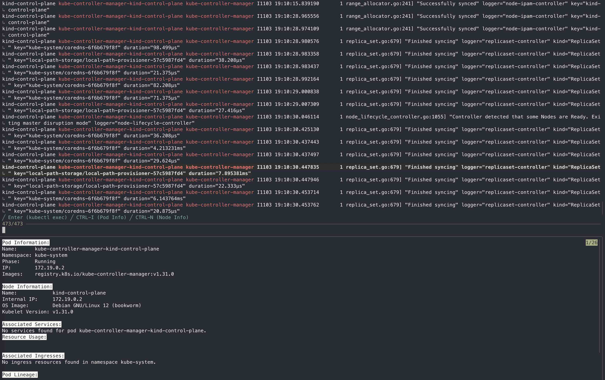

# Kubernetes Funny Log Viewer (kubectl-flv)

This project is designed to streamline and enhance the Kubernetes logging and inspection experience. It leverages `kubectl`, `stern`, `fzf`, and `jq` to create an interactive log viewer, allowing users to search, filter, and inspect logs from Kubernetes pods, along with retrieving detailed information about associated resources. The goal is to provide a more flexible and interactive approach to viewing logs, inspecting pods, nodes, services, and ingress information instead of bunch of disparate resources

Inspired by <https://junegunn.github.io/fzf/tips/browsing-log-streams/>

## Usage

Refer to the fzf search syntax at [fzf's GitHub page](https://github.com/junegunn/fzf#search-syntax).

```bash
kubectl flv [OPTIONS] [POD_NAME_PATTERN] [STERN_ADDITIONAL_PARAMETERS]
```

### Options

- `--fzf`: Use `fzf` for interactive pod selection.
- `-n`, `--namespace`: Specify the Kubernetes namespace to use.
- `-h`, `--help`: Display the help message and exit.

### Examples

- **Follow logs of all pods in the current namespace**:

  ```
  kubectl flv
  ```

- **Follow logs of pods matching a pattern in a specific namespace**:

  ```
  kubectl flv -n my-namespace pod-name-pattern
  ```

- **Use interactive pod selection with `fzf`**:

  ```
  kubectl flv --fzf
  ```

- **Use interactive pod selection with `fzf` in a specific namespace**:

  ```
  kubectl flv --fzf -n my-namespace
  ```

- **Follow logs from the last 1 hour for pods matching 'kube'**:

  ```
  kubectl flv kube -s 1h
  ```



### Keybindings in `fzf`

- **Enter**: Execute `kubectl exec` into the selected pod.
- **Ctrl-I**: Show Pod Info.
- **Ctrl-N**: Show Node Info.
- **Ctrl-F**: Toggle following logs.
- **Ctrl-P**: Toggle Preview window.
- **Shift-Up/Down**: Scroll the Preview window.

## Prerequisites

- **Kubernetes CLI (`kubectl`)**: Ensure `kubectl` is installed and configured to access your Kubernetes cluster.
- **Krew**: Install Krew to manage `kubectl` plugins.

## Installation Steps

### 1. Install Krew

If you don’t have Krew installed, follow the [installation instructions](https://krew.sigs.k8s.io/docs/user-guide/setup/install/) on the official website.

### 2. Install Required Plugins with Krew

```bash
kubectl krew install stern
kubectl krew install lineage
```

### 3. Install Additional Dependencies

- **fzf**:

  - On Debian/Ubuntu:

    ```bash
    sudo apt update && sudo apt install fzf
    ```

  - On macOS (via Homebrew):

    ```bash
    brew install fzf
    ```

- **jq**:

  - On Debian/Ubuntu:

    ```bash
    sudo apt update && sudo apt install jq
    ```

  - On macOS (via Homebrew):

    ```bash
    brew install jq
    ```

### 4. Install the Plugin Script

```bash
git clone https://github.com/loktionovam/kubectl-flv.git
cd kubectl-flv
chmod +x kubectl-flv kubectl-flv-preview
sudo cp kubectl-flv kubectl-flv-preview /usr/local/bin/
```

Alternatively, you can add the script to your `PATH`.
